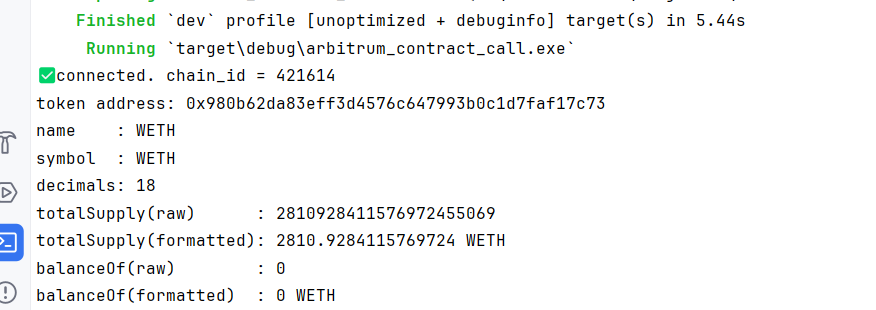

查询链信息
provider.get_chainid()
读取当前 RPC 连接的链 ID
2) 校验地址是不是合约
provider.get_code(token_addr, None)
如果返回 0x（空），说明这个地址在当前链上不是合约（地址填错或链连错）。
3) 对 ERC20 合约做只读调用（view）
通过 contract.method(...).call() 调用了这些函数：
name()
**作用：**读取代币名称（string）
symbol()
**作用：**读取代币符号（string）
decimals()
**作用：**读取小数位（uint8）
totalSupply()
**作用：**读取代币总供应量（uint256）
balanceOf(address)
**作用：**读取某个地址的余额（uint256）
